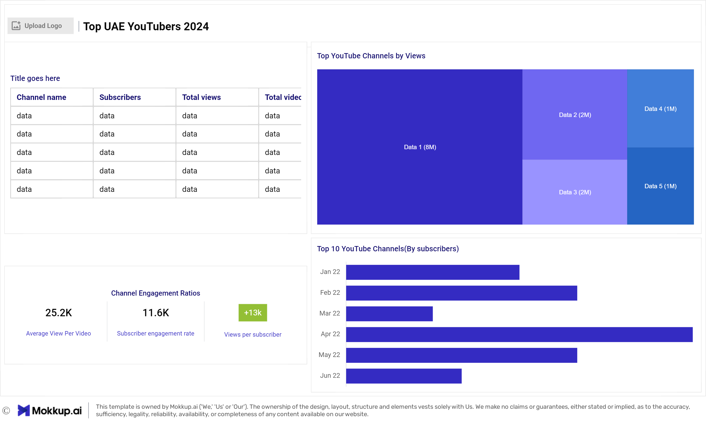

# Data Portfolio: Excel to Power BI 


# Table of contents 

- [Objective](#objective)
- [Data Source](#data-source)
- [Stages](#stages)
- [Design](#design)
  - [Mockup](#mockup)
  - [Tools](#tools)
- [Development](#development)
  - [Pseudocode](#pseudocode)
  - [Data scraping](#data-scraping)
  - [Data Exploration](#data-exploration)
  - [Data Cleaning](#data-cleaning)
  - [Transform the Data](#transform-the-data)
  - [Create the SQL View](#create-the-sql-view)
- [Testing](#testing)
  - [Data Quality Tests](#data-quality-tests)
- [Visualization](#visualization)
  - [Results](#results)
  - [DAX Measures](#dax-measures)
- [Analysis](#analysis)
  - [Findings](#findings)
  - [Validation](#validation)
  - [Discovery](#discovery)
- [Recommendations](#recommendations)
  - [Potential ROI](#potential-roi)
  - [Potential Courses of Actions](#potential-courses-of-actions)
- [Conclusion](#conclusion)


# Objective 

- What is the key pain point? 

The Head of Marketing wants to find out who the top YouTubers are in 2024 to decide on which YouTubers would be best to run marketing campaigns throughout the rest of the year.

- What is the ideal solution? 

To create a dashboard that provides insights into the top UAE YouTubers in 2024 that includes their 
- subscriber count
- total views
- total videos, and
- engagement metrics

This will help the marketing team make informed decisions about which YouTubers to collaborate with for their marketing campaigns.


## User story 

As the Head of Marketing, I want to use a dashboard that analyses YouTube channel data in the UAE . 

This dashboard should allow me to identify the top performing channels based on metrics like subscriber base and average views. 

With this information, I can make more informed decisions about which Youtubers are right to collaborate with, and therefore maximize how effective each marketing campaign is.


# Data source 

- What data is needed to achieve our objective?

We need data on the top UAE YouTubers in 2024 that includes their 
- channel names
- total subscribers
- total views
- total videos uploaded


- Where is the data coming from? 
The data is sourced from Kaggle (an Excel extract), [see here to find it.](https://www.kaggle.com/datasets/bhavyadhingra00020/top-100-social-media-influencers-2024-countrywise?resource=download)


# Stages

- Design
- Developement
- Testing
- Analysis 
 


# Design 


## Dashboard components required 
- What should the dashboard contain based on the requirements provided?

To understand what it should contain, we need to figure out what questions we need the dashboard to answer:

1. Who are the top 10 YouTubers with the most subscribers?
2. Which 3 channels have uploaded the most videos?
3. Which 3 channels have the most views?
4. Which 3 channels have the highest average views per video?
5. Which 3 channels have the highest views per subscriber ratio?
6. Which 3 channels have the highest subscriber engagement rate per video uploaded?

For now, these are some of the questions we need to answer, this may change as we progress down our analysis. 


## Dashboard mockup

- What should it look like? 

Some of the data visuals that may be appropriate in answering our questions include:

1. Table
2. Treemap
3. Scorecards
4. Horizontal bar chart 





## Tools 


| Tool | Purpose |
| --- | --- |
| Excel | Exploring the data |
|Python | Scrap, update the data from YouTube |
| SQL Server | Cleaning, testing, and analyzing the data |
| Power BI | Visualizing the data via interactive dashboards |
| GitHub | Hosting the project documentation and version control |
| Mokkup AI | Designing the wireframe/mockup of the dashboard |


# Development


## Pseudocode

- What's the general approach in creating this solution from start to finish?

1. Get the data
2. Scrap the data from YouTube with Python
3. Explor the data with Excel 
4. Load the data into SQL Server
5. Clean the data with SQL
6. Test the data with SQL
7. Visualize the data in Power BI
8. Generate the findings based on the insights
9. Write the documentation + commentary
10. Publish the data to GitHub Pages


## Data scraping 

This is the process of importing information from a YouTube into a Excel 

1.  retrieves statistics for a list of YouTube channels using the YouTube Data API and presents the data in a Pandas DataFrame.
2. We use the channels IDs to get the updated data 
3. Export the data to excel sheet and do the Exporation once again

### Scraping the Data 
```Python
# 1. Import necessary libraries(Google clint api, Pandas)
# 2. API key for accessing the YouTube Data API
# 3. Build the YouTube service object using the provided API key
# 4. Function to get channel statistics for a list of channel IDs
# 5. Execute the request and store the response
# 6. Return the list of all channel data, Display the data 
```
### 1. Import necessary libraries(Google clint api, Pandas)
```python

# Import necessary libraries
from googleapiclient.discovery import build 
import pandas as pd
```
### 2. API key for accessing the YouTube Data API


```python
# API key for accessing the YouTube Data API
api_key = ''

# List of YouTube channel IDs we want to retrieve data for
channel_ids = []
```
### 3. Build the YouTube service object using the provided API key

```python
# Build the YouTube service object using the provided API key
youtube = build('youtube', 'v3', developerKey=api_key)

```
### 4. Function to get channel statistics for a list of channel IDs
```python 

# Function to get channel statistics for a list of channel IDs
def get_channel_stats(youtube, channel_ids):
    all_data = []  # Define the list to store all channel data
    
    # Make a request to the YouTube API to get channel details
    request = youtube.channels().list(
        part='snippet,contentDetails,statistics',  # Parts of the channel resource to retrieve
        id=','.join(channel_ids)  # Join the list of channel IDs into a comma-separated string
    )
```
### 5. Execute the request and store the response

```python 

    # Execute the request and store the response
    response = request.execute()

    # Loop through the items in the response
    for i in range(len(response['items'])):
        # Extract relevant data from each channel's response
        data = dict(
            Channel_name=response['items'][i]['snippet']['title'],  # Channel name
            Subscribers=response['items'][i]['statistics']['subscriberCount'],  # Subscriber count
            Views=response['items'][i]['statistics']['viewCount'],  # Total view count
            Total_videos=response['items'][i]['statistics']['videoCount']  # Total number of videos
        )
        
        # Append the extracted data to the all_data list
        all_data.append(data)
``` 
### 6. Return the list of all channel data, Display the data 

```python 

    # Return the list of all channel data
    return all_data

# Get statistics for the specified channels
channel_statistics = get_channel_stats(youtube, channel_ids)

# Convert the list of channel statistics to a Pandas DataFrame for easier manipulation and analysis
channel_data = pd.DataFrame(channel_statistics)

# Display the DataFrame
channel_data

```
### Output 


## Data exploration notes

This is the stage where you have a scan of what's in the data, errors, inconcsistencies, bugs, weird and corrupted characters etc  


- What are your initial observations with this dataset? What's caught your attention so far? 

1. There are at least 4 columns that contain the data we need for this analysis, which signals we have everything we need from the file without needing to contact the client for any more data. 
2. The first column contains the channel ID with what appears to be channel IDS, which are separated by a @ symbol - we need to extract the channel names from this.
3. Some of the cells and header names are in a different language - we need to confirm if these columns are needed, and if so, we need to address them.
4. We have more data than we need, so some of these columns would need to be removed


## Data cleaning 

- What do we expect the clean data to look like? (What should it contain? What contraints should we apply to it?)

The aim is to refine our dataset to ensure it is structured and ready for analysis. 

The cleaned data should meet the following criteria and constraints:

- Only relevant columns should be retained.
- All data types should be appropriate for the contents of each column.
- No column should contain null values, indicating complete data for all records.

Below is a table outlining the constraints on our cleaned dataset:

| Property | Description |
| --- | --- |
| Number of Rows | 100 |
| Number of Columns | 4 |

And here is a tabular representation of the expected schema for the clean data:

| Column Name | Data Type | Nullable |
| --- | --- | --- |
| channel_name | NVARCHAR | NO |
| total_subscribers | INTEGER | NO |
| total_views | INTEGER | NO |
| total_videos | INTEGER | NO |


- What steps are needed to clean and shape the data into the desired format?
1. Update the wrong rows
2. Remove the duplicated data
3. Rename columns


### Transform the data 

```sql
/*
# 1. Select the required columns
# 2. Select the Top 100 
*/

SELECT TOP (100) 
    [Channel_Names], 
    [Total_Subscribers],
    [Total_Views],
    [Total_Videos]

  FROM [YouTube_db].[dbo].[YT_UAE_2024]


```

### Create the SQL view 

```sql
/*
# 1. Create a view to store the transformed data
# 2. Cast the extracted channel name as NVARCHAR(100)
# 3. Select the required columns from the top_UAE_youtubers_2024 SQL table 
*/
-- 1.
CREATE VIEW view_uae_youtubers_2024 as
SELECT TOP (100) 
-- 2.
    CAST([Channel_Names] AS NVARCHAR(100)) AS [Channel_Names],
      [Total_Subscribers],
      [Total_Views],
      [Total_Videos]
-- 3.
  FROM [YouTube_db].[dbo].[YT_UAE_2024]
  ORDER BY Total_Views DESCan


```


# Testing 

- What data quality and validation checks are you going to create?

Here are the data quality tests conducted:

## Row count check
### SQL query 

```sql
/*
# Count the total number of records (or rows) are in the SQL view
*/

SELECT 
	COUNT(*) as no_of_rows
FROM view_uae_youtubers_2024;

```

### Output


## Column count check
### SQL query 
```sql
/*
# Count the total number of columns (or fields) are in the SQL view
*/

ELECT 
	COUNT(*) as column_count 
FROM 
	INFORMATION_SCHEMA.COLUMNS
WHERE 
	TABLE_NAME = 'view_uae_youtubers_2024'


```
### Output


## Data type check
### SQL query 
```sql
/*
# Check the data types of each column from the view by checking the INFORMATION SCHEMA view
*/

SELECT 
	COLUMN_NAME,
	DATA_TYPE
FROM 
	INFORMATION_SCHEMA.COLUMNS
WHERE 
	TABLE_NAME = 'view_uae_youtubers_2024'


```
### Output


## Duplicate count check
### SQL query 
```sql
/*
# 1. Check for duplicate rows in the view
# 2. Group by the channel name
# 3. Filter for groups with more than one row
*/
SELECT 
	channel_names,
	COUNT(*) as duplicate_count
FROM 
	view_uae_youtubers_2024

GROUP BY 
	Channel_Names 
HAVING 
	COUNT(*) > 1 

```
### Output


# Visualization 


## Results

- What does the dashboard look like?


This shows the Top UAE Youtubers in 2024 so far. 

## DAX Measures


### 1. Total Subscribers (M)
```sql

Total Subscribers (M) = 
VAR million = 1000000
VAR sumOfSubscribers = SUM(view_uae_youtubers_2024[Total_Subscribers])
VAR totalSubscribers = DIVIDE(sumOfSubscribers,million)

RETURN totalSubscribers

```

### 2. Total Views (B)
```sql

Total Views (B) = 
VAR billion = 1000000000
VAR sumOfTotalViews = SUM(view_uae_youtubers_2024[total_views])
VAR totalViews = ROUND(sumOfTotalViews / billion, 2)

RETURN totalViews

```

### 3. Total Videos
```sql

Total Videos = 
VAR totalVideos = SUM(view_uae_youtubers_2024[total_videos])

RETURN totalVideos

```
### 4. Average Views Per Video (M)
```sql

Average Views per Video (M) = 
VAR sumOfTotalViews = SUM(view_uae_youtubers_2024[total_views])
VAR sumOfTotalVideos = SUM(view_uae_youtubers_2024[total_videos])
VAR  avgViewsPerVideo = DIVIDE(sumOfTotalViews,sumOfTotalVideos, BLANK())
VAR finalAvgViewsPerVideo = DIVIDE(avgViewsPerVideo, 1000000, BLANK())

RETURN finalAvgViewsPerVideo 

```

### 5. Subscriber Engagement Rate
```sql

Subscriber Engagement Rate = 
VAR sumOfTotalSubscribers = SUM(view_uae_youtubers_2024[total_subscribers])
VAR sumOfTotalVideos = SUM(view_uae_youtubers_2024[total_videos])
VAR subscriberEngRate = DIVIDE(sumOfTotalSubscribers, sumOfTotalVideos, BLANK())

RETURN subscriberEngRate 

```
### 6. Views per subscriber
```sql

Views Per Subscriber = 
VAR sumOfTotalViews = SUM(view_uae_youtubers_2024[total_views])
VAR sumOfTotalSubscribers = SUM(view_uae_youtubers_2024[total_subscribers])
VAR viewsPerSubscriber = DIVIDE(sumOfTotalViews, sumOfTotalSubscribers, BLANK())

RETURN viewsPerSubscriber 

```


# Analysis 

## Findings

